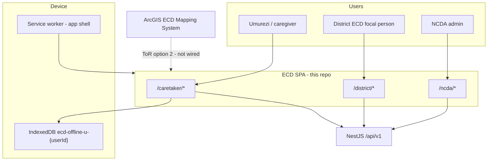
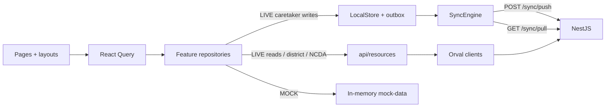
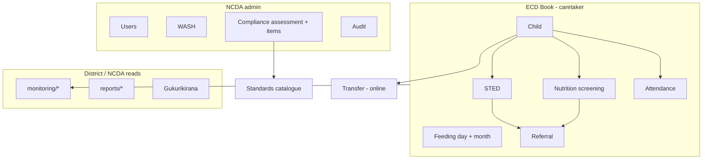
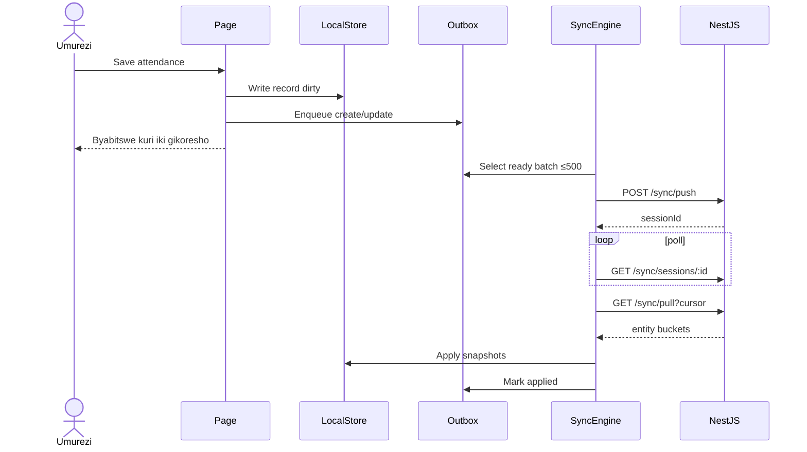
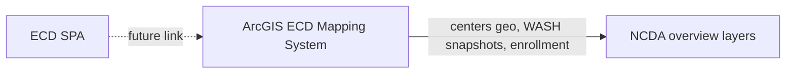

# System architecture

**System:** ECD Rwanda operational frontend + NestJS API  
**Date:** August 2026

---

## 1. Context

Three user portals share one SPA and one backend. Caretaker is offline-first. District and NCDA are online. The existing **ArcGIS ECD Mapping System** remains the national center map; this app does not replace it.



---

## 2. Logical architecture



**Decisions:**

1. React Query is ephemeral. Durable caretaker data is Dexie.
2. MOCK and LIVE share the same pages. Pages must not branch on fake success in LIVE.
3. Generated API code is never edited by hand.

---

## 3. Portals and navigation

### 3.1 Caretaker

| Path | Function |
|---|---|
| `/caretaker` | Dashboard |
| `/caretaker/kwiyandikisha` | Register child |
| `/caretaker/ubwitabire` | Daily attendance |
| `/caretaker/abana`, `/abana/:id` | Children list / detail / edit |
| `/caretaker/imikurire` | Growth / MUAC |
| `/caretaker/imikurire/ukwezi` | Monthly growth roster |
| `/caretaker/imirire` | Daily feeding |
| `/caretaker/imirire/raporo` | Monthly feeding summary |
| `/caretaker/sted` | STED list / new wizard / history |
| `/caretaker/raporo` | Attendance report |
| `/caretaker/ibindi` | More hub |
| `/caretaker/igenamiterere` | Settings + sync diagnostics |

Bottom nav: Ahabanza, Abana, Ubwitabire, Imikurire, Ibindi.

### 3.2 District

| Path | Function |
|---|---|
| `/district` | Incamake (command dashboard; GIS lives here conceptually) |
| `/district/ibigo` | Centers |
| `/district/abana` | Children |
| `/district/imikorere` | Monitoring hub + attendance / growth / feeding / STED tabs |
| `/district/gukurikirana` | Follow-up alerts |
| `/district/raporo` | Reports |
| `/district/abakoresha` | Caregiver users |
| `/district/igenamiterere` | Settings |

Canonical paths: `src/layouts/district/navigation.ts`.

### 3.3 NCDA

| Path | Function |
|---|---|
| `/ncda/dashboard` | National overview |
| `/ncda/monitoring` | National monitoring |
| `/ncda/inspections` | Compliance assessments |
| `/ncda/reports` | Reports |
| `/ncda/users`, `/roles` | Governance |
| `/ncda/settings` | Settings (devices + sync deep-links) |
| `/ncda/audit-logs` | Audit log browser |
| `/ncda/districts`, `/centers`, `/children` | Contextual geo/ops |
| `/ncda/wash` | WASH indicators |

Canonical paths: `src/layouts/ncda/navigation.ts`.

---

## 4. Identity and tenancy

```text
JWT
  role: caregiver | district_focal_person | ncda_admin
  userId
  centerId?     (caregiver)
  districtId?   (district)

Device
  deviceUuid    (localStorage, survives logout)
  x-device-id   (header)

Offline workspace
  ecd-offline-u-{userId}   (private)
```

Server operational data is **center-scoped**. Local isolation is **user-scoped** so two caregivers on one tablet cannot see or push each other’s outbox.

---

## 5. Data domains



### Syncable entity types

| Entity | Caretaker offline |
|---|---|
| `child` | Yes |
| `attendance_record` | Yes |
| `child_nutrition_screening` | Yes |
| `center_feeding_day` | Yes |
| `center_feeding_month_summary` | Yes |
| `sted_assessment` | Yes |
| `referral` | Yes |
| `child_transfer` | No (online) |
| `ecd_center` | Server / NCDA |
| `wash_indicator` | NCDA online |
| `compliance_assessment` / `_item` | NCDA online |

---

## 6. Sync sequence (caretaker LIVE)



Push only sends ops for the **current** `ownerUserId`. Mid-cycle account switch cannot redirect writes.

---

## 7. Compliance / standards module (as built)

Not the four PDF inspection tools. Current shape:

```text
Standard (domain, code, title, weight, version)
    ↑
Assessment (type, status, classification, center, date)
    ↑
Assessment item (response, score, gap severity/status/action/date)
```

| Concept | Values |
|---|---|
| Type | `self_assessment`, `supportive_supervision`, `external_audit` |
| Status | `draft` → `submitted` → `verified` \| `rejected` |
| Classification | `compliant`, `partially_compliant`, `non_compliant` |
| Domain | `wash`, `safety`, `nutrition`, `learning_environment` |

NCDA UI: paginated list + detail + optional standards catalogue. National KPI rollups require backend aggregates (not computed in the SPA).

---

## 8. GIS

- District `/district/ikarita` redirects to Incamake.
- `DistrictMapView` renders `GisPendingPlaceholder` — wait for GIS-team ArcGIS integration.
- NCDA overview has map **layer definitions** (centers live; coverage/compliance/WASH/etc. marked unavailable until APIs exist).

Do not build a parallel non-ArcGIS map stack in this SPA.



---

## 9. Deployment view

```text
Browser (PWA)
  static assets from hosting (HTML/JS/CSS)
  IndexedDB on device
        |
        | HTTPS + JWT + x-device-id
        v
NestJS API (separate deploy)
  /api/v1/auth
  /api/v1/children | attendance | feeding | nutrition | sted | referrals
  /api/v1/sync/*
  /api/v1/monitoring/* | /reports/*
  /api/v1/compliance | /wash | /users | /audit-logs | /geo
        |
        v
Database (backend-owned)
```

Hosting of the SPA is static. API CORS, TLS, backups, and DB are backend/ops responsibilities.

---

## 10. Design constraints (UX)

From `design.md`:

- One primary action per screen
- Large type, labeled controls
- Kinyarwanda first
- Caretaker = phone / outdoor / low digital literacy
- District/NCDA = higher density, same brand tokens

---

## 11. Trust boundaries

| Trust | Mechanism |
|---|---|
| Who can open a portal | JWT role + `ProtectedRoute` |
| Who can see a center’s children | Backend scope (center / district / national) |
| Who can push local ops | Outbox `ownerUserId` + current JWT |
| What “saved” means | Local confirmation ≠ server apply |
| What LIVE may invent | Nothing — unavailable states only |
